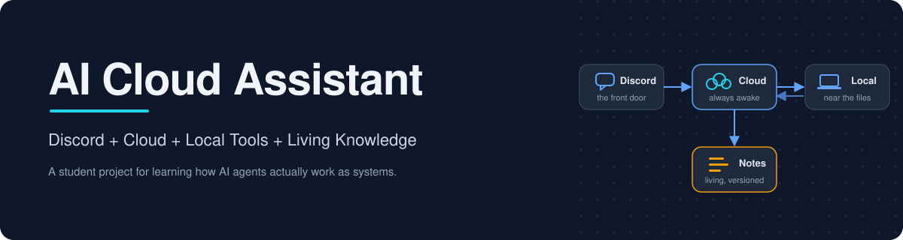
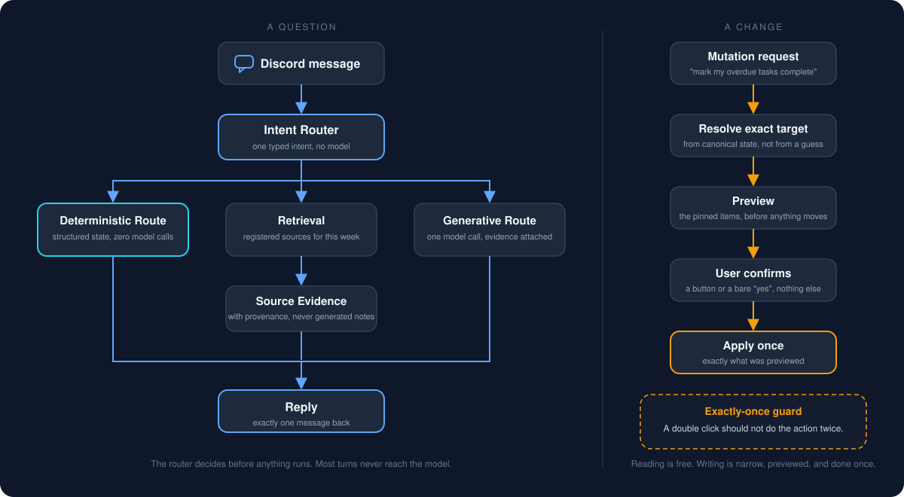
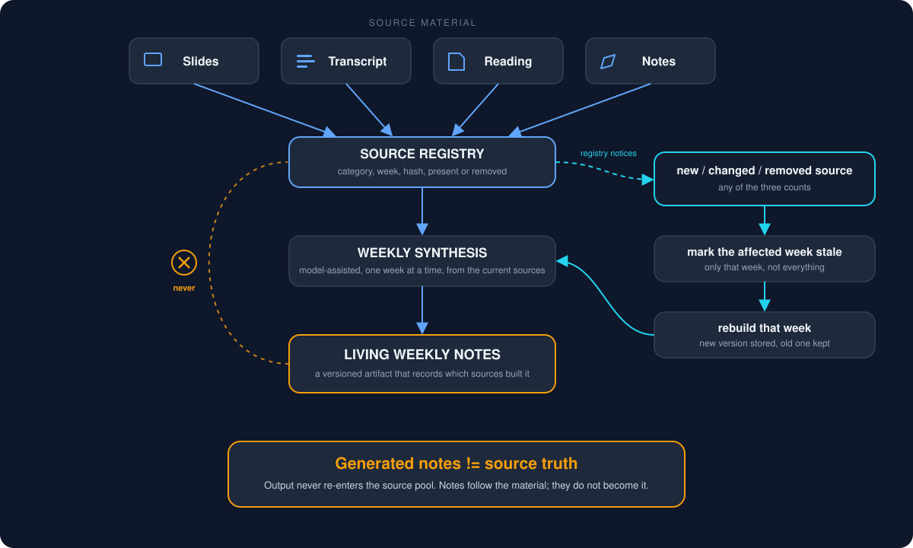
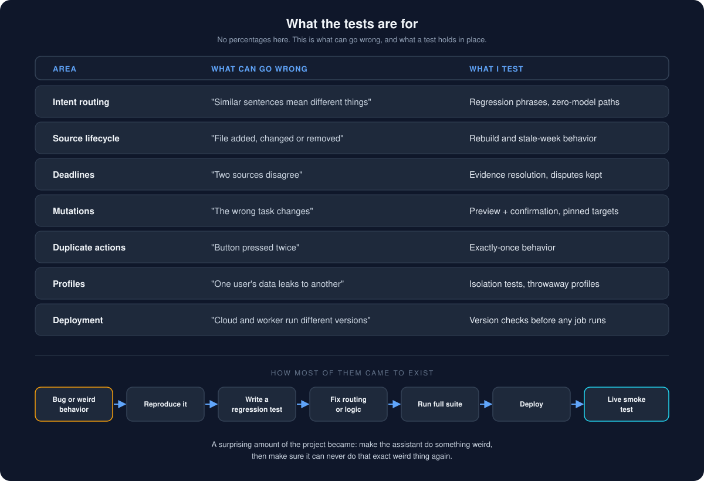
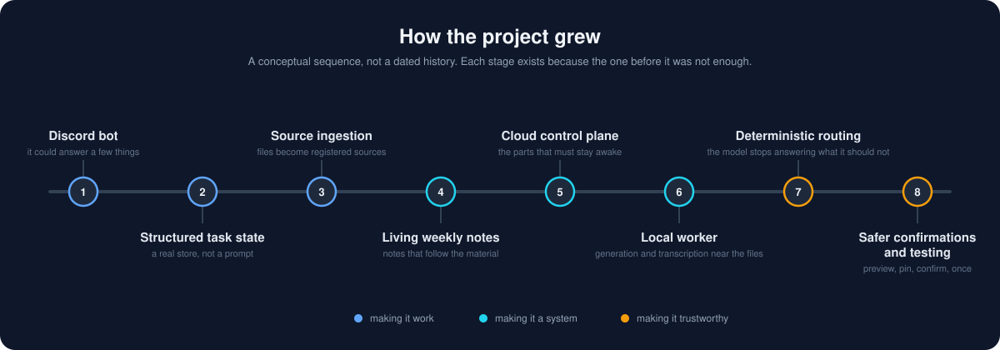

# AI Cloud Assistant



<p align="center">
  
  
  
  
  
  
  
</p>

## Why I Built It

I started with a pretty simple idea. Material for my classes arrived in a lot of formats: slides, readings, recorded sessions, transcripts, and the occasional PDF that was really a photo of a PDF. Deadlines were mentioned in slides, repeated (sometimes differently) in transcripts, and corrected out loud in class. I wanted one assistant I could just talk to that would keep track of all of it, without me spending my evenings reorganizing folders by hand.

I originally thought the model would be the hard part. It wasn't. The hard parts were everything around it: knowing where a fact came from, noticing when a file changed, deciding which of two disagreeing dates to trust, and making sure "mark those done" only ever did what I had just been shown. That is what most of this repository is about.

## What It Does

From Discord I can ask things like:

- "What is due this week?"
- "Explain what we covered this week."
- "What changed in my notes?"
- "Mark my overdue tasks complete."
- "hey, you there?"
- "How to do assignment X?"

Behind that chat window there is a small system that:

- keeps one canonical store of tasks, deadlines and source records,
- watches the folders where class material lands and registers every file,
- extracts deadline evidence from that material and resolves disagreements,
- rebuilds weekly study notes when the material for a week changes,
- transcribes recordings locally so the spoken parts of a class become searchable text,
- routes each message to the cheapest thing that can answer it correctly, which often is not a language model at all.

## The 30-Second Architecture


The user talks to Discord. Discord talks to a small always-on service on a cloud VM, which I think of as the control plane. The control plane owns the state (tasks, deadlines, the source registry), runs the scheduler, and decides how each message should be handled. Work that needs my files or a model call is handed to a local worker on my computer, which picks up jobs, does them close to the files, and reports back. Source material flows the other way: a sync process on my computer notices new or changed files and pushes them to the control plane's registry.

Two rules hold the whole thing together: there is exactly one writable copy of the state, and the cloud does the things that must stay awake. The longer version is in [docs/ARCHITECTURE.md](docs/ARCHITECTURE.md).

## Discord Is the Front Door

I did not want to think about which subsystem should answer a message, so the assistant does that. Every message goes through an interpretation step that produces one typed intent: is this a deadline question, a task update, a knowledge question, a conversational message, or something that genuinely needs generation?



That decision matters more than I expected. "What is due this week?" is a query against structured state with a known answer. Asking a language model to guess it would be slower, less reliable, and slightly absurd. So deadline questions hit the database. Task updates go through a confirmation flow. Knowledge questions retrieve evidence first. And a bare "hey" gets a bare "hey" back, with no model involved.

## Living Weekly Notes



This is my favourite part. Weekly notes are not files that get generated once and slowly go stale. The assistant watches the source material, and the notes for a week are rebuilt whenever that week's inputs change.

Say a week starts with slides and a transcript. Notes get generated from those two. A few days later a reading appears in the folder. The source registry notices, marks that week's notes as stale, and the next rebuild uses slides plus transcript plus reading. If a source is removed, the next rebuild no longer uses it. I call them living notes because that is what they do: they follow the material.

One rule I had to learn the hard way: generated notes are output, not source truth. They never go back into the pool of things the assistant learns from. Otherwise the assistant would eventually be summarizing its own summaries, which is a very efficient way to lose the plot. More in [docs/LIVING_NOTES.md](docs/LIVING_NOTES.md).

## Finding Deadlines in Messy Sources


Deadlines do not arrive in a neat table. They show up in syllabi, in the corner of a slide, in a sentence in a transcript, and in the transcript of a recording where someone says "actually, let's push that to Friday."

So the assistant extracts deadline evidence from each source and turns it into structured claims: this source says this thing is due at this time. Claims are kept, not overwritten. When two sources disagree, resolution rules pick a winner based on how authoritative the source is, whether one of them was an explicit update, and whether I have confirmed a correction myself. If the evidence conflicts and there is no clear winner, the system keeps the disagreement visible and asks, instead of quietly picking one and pretending to be sure.

My early version just let the most recent date win. It took about a week of real use to see why that was a bad idea. The details are in [docs/DEADLINE_PIPELINE.md](docs/DEADLINE_PIPELINE.md).

## Cloud vs Local


The project started entirely on my laptop, which meant the assistant went to sleep when my laptop did. Moving to the cloud fixed that, but I learned pretty quickly that cloud adoption did not mean "move absolutely everything to the cloud."

I kept the cloud responsible for the things that need to stay awake: the Discord connection, the canonical state, the scheduler, routing, and the source registry. The local worker handles jobs that make more sense close to the files: model-assisted generation, transcription of recordings, and anything that needs the actual documents on disk. A sync process and a small worker protocol connect the two. There is a longer write-up in [docs/CLOUD_ADOPTION.md](docs/CLOUD_ADOPTION.md).

## Architecture Choices I Started to Understand

I kept seeing the term control plane while reading about cloud systems. It made much more sense once I actually needed one. This section is the handful of ideas that stopped being vocabulary and started being decisions, roughly in the order I ran into them.

### Control plane

For a long time everything ran in one process on my laptop, and "the server" in my head was the thing that did the work. Eventually I separated the always-on coordination layer from the worker that does the heavier or file-bound jobs, and I started to understand why those are different things. The cloud side coordinates what needs to stay available: the Discord connection, the canonical state, scheduling, routing, the source registry, task and deadline state, and handing jobs to the worker. It mostly knows what the work is and who is doing it. The worker does the work.

### One source of truth

There is exactly one canonical writable state store, and it lives on the cloud side. I learned that having two computers both independently editing their own copy of the same state is a quick way to create two versions of reality. I briefly had exactly that, and I spent more time working out which copy was right than building anything. Now the worker and the sync process submit jobs, results and file changes through the control plane, and neither of them owns the truth.

### Cloud does not mean everything belongs in the cloud

My first instinct after "the laptop goes to sleep" was to move all of it to the VM. That turned out to be the wrong question. The useful question was which responsibilities need to stay available, and which ones make more sense near the files.

| Responsibility | Where | Why |
| --- | --- | --- |
| Discord connection | Cloud | Needs to stay available |
| Canonical state | Cloud | One source of truth |
| Scheduling | Cloud | Runs without my laptop |
| Routing | Cloud | Decides before anything runs |
| Source files | Local | Already live there |
| Transcription | Local | Keeps raw recordings local |
| Generation worker | Local | Uses the local model and tool environment |

Cloud adoption became a question of responsibility placement, not simply uploading everything. I am still learning this, but it is the one idea from this project I expect to reuse the most.

### Deterministic before generative

I originally assumed an AI assistant should send most questions to the model. Not every request deserves an LLM call. "What is due this week?" has an exact answer in structured deadline state, and asking a model to guess it is slower and less reliable than looking it up. "Explain this week's material" is different: that one genuinely benefits from retrieving the sources and generating a synthesis. Sorting requests this way made the assistant easier to test, more predictable, and safer when changing state, because no model is choosing what to change. There is a fuller version of this rule below, in Deterministic First, AI When Useful.

## What I Mean by an Agent Harness

At first I thought an agent was basically prompt + model + tools. By the end I understood why the surrounding system matters just as much, and I started calling that system the harness.

The model is the reasoning engine. The harness is the part that gives it rules, tools, memory boundaries, and somewhere safe to operate. In this project the harness handles intent routing, tool selection, evidence retrieval, structured state, confirmation before anything is changed, logging of every model call, deterministic shortcuts that skip the model entirely, source provenance, worker coordination, and a version check so an out-of-date worker cannot quietly answer as if it were current.

Building this changed how I think about AI agents. The model got smarter over the course of the project without me doing anything. The harness only got better because I kept finding out, one confusing answer at a time, what it was missing. More in [docs/AGENT_HARNESS.md](docs/AGENT_HARNESS.md).

## Deterministic First, AI When Useful

Some requests should not use a language model at all.

```text
message
  -> interpret intent
  -> deterministic route if possible
  -> retrieve evidence if needed
  -> model only when useful
```

"What deadlines do I have this week?", "mark these tasks complete", and simple conversational pings are all handled by routing plus structured data. Generation is reserved for things that actually need synthesis or explanation: "explain what we covered this week", "help me plan this assignment", "what did the instructor say about this topic?"

This turned out to matter for reasons beyond speed. Deterministic paths are easy to test, mutations are safer when no model is choosing what to change, and answers are predictable. I am not going to quote a cost saving, because I did not measure one carefully. I can say that the number of model calls per day dropped noticeably once the boring questions stopped going to the model.

## A Few Design Rules I Learned the Hard Way

- **One brain.** There is one canonical state store, on the cloud side. The local worker does not keep its own writable copy of the same database. Two writable copies means two versions of reality, and I did not want to be the one reconciling them.
- **Reading is not writing.** Questions can be answered freely. Anything that changes state goes through resolve, preview, confirm, apply, in that order.
- **Pin before you confirm.** When I say "mark my overdue tasks complete", the assistant resolves the exact set, shows it to me, and pins those specific items. Confirming applies exactly what I previewed, not whatever the same words would select a minute later.
- **Once means once.** I learned that "run this once" sounds easy until retries, duplicate messages, and confirmation buttons get involved. Every applied change is recorded under a unique token, so a duplicate confirmation is recognised instead of being applied twice.
- **Generated output never becomes input.** Notes, summaries and quizzes are results. The source pool is only ever the original material.
- **Provenance or it did not happen.** Every extracted fact points back to the source record it came from, so when a file changes the assistant knows what to reconsider.

The longer list, with the reasoning, is in [docs/DESIGN_DECISIONS.md](docs/DESIGN_DECISIONS.md).

## The Part Where I Learned to Write Tests

As the assistant became more useful, natural-language edge cases started to matter more than anything else. The same words mean different things a few characters apart, and each of these once sent a message to the wrong place:

- "yes" versus "yes, and also..."
- "mark everything overdue complete" versus "I haven't completed everything overdue"
- "what is my name?" versus "what is the name of the dataset?"
- a source being added, versus modified, versus removed
- a confirmation button being pressed twice
- two profiles asking the same personal question

Every one of those became a regression test. The private implementation eventually grew past 2,000 automated tests. That sounds dramatic for a personal assistant, but many of them are tiny regression tests for sentences that broke something once.



At a high level they cover intent and routing, deadline interpretation, source ingestion, changed and deleted source handling, weekly-note rebuilding, task mutations, confirmation and duplicate-action protection, profile isolation, deterministic versus model-assisted paths, database integrity, and deployment version consistency. The routing tests run with a model provider that raises an error if it is called at all, so "this path makes zero model calls" is something the suite proves rather than something I claim.

This was my first real exposure to writing tests for things that are not functions with obvious inputs. A surprising amount of the project became: make the assistant do something weird, then make sure it can never do that exact weird thing again.

## Project Evolution



This is a conceptual timeline, not a changelog. It started as a Discord bot that could answer a few questions. Then it needed real task state, then a way to ingest sources, then living notes on top of those sources. Moving the always-on parts to a cloud control plane came next, followed by a local worker for the file-heavy work. The last two stages were less glamorous and more important: deterministic routing so the model stops answering questions it should not, and safer confirmations backed by a lot of small regression tests.

I did not start with this architecture, and I want to be honest about that, because the evolution is most of what I learned. Roughly:

```text
Discord bot
  -> structured tasks
  -> source ingestion
  -> living notes
  -> cloud control plane
  -> local worker
  -> deterministic routing
  -> safer state changes
  -> testing weird edge cases
```

Each step exists because the one before it was not enough. Nobody sat down on day one and designed a hybrid system with a control plane and an exactly-once guard. I got there by being annoyed at specific things, in that order.

## What I Learned

- An AI assistant is mostly a systems problem once it becomes useful.
- File synchronization is easy until deletion becomes a meaningful event. I also learned that "the file disappeared" is technically an event, which is less funny when the event is your entire project.
- Generated notes should not become their own source.
- State ownership matters. Decide who is allowed to write, and make everyone else read.
- A cloud VM being always on changes what an assistant can be. Reminders, scheduled rebuilds and a bot that answers at 2 a.m. are only possible because something is awake.
- Deterministic routing can be more valuable than another model call.
- Confirmations matter when natural language can change data.
- Provenance becomes important the moment two sources disagree.
- Testing natural language requires weird little regression cases. My test suite contains sentences I would struggle to explain out of context.
- Git and recoverability matter, and "I will set up backups later" is a sentence with a deadline you do not get to choose.

I am still learning, but this project made ideas like state ownership, routing, cloud workers, and agent harnesses much less abstract. The full list is in [docs/WHAT_I_LEARNED.md](docs/WHAT_I_LEARNED.md).

## What This Repository Is

This repository is a sanitized architecture and report version of the project. It contains original documentation and diagrams and nothing else. It does not contain the production codebase, any private or academic material, personal data, network or deployment configuration, or credentials. See [docs/PRIVACY.md](docs/PRIVACY.md) for what was deliberately left out and why.

## Status

Learning project / working prototype. It runs, I use it every day, and it is one person's study assistant rather than a product. Expect rough edges and opinions.

## Documents

- [Architecture](docs/ARCHITECTURE.md)
- [Agent harness](docs/AGENT_HARNESS.md)
- [Cloud adoption](docs/CLOUD_ADOPTION.md)
- [Living notes](docs/LIVING_NOTES.md)
- [Deadline pipeline](docs/DEADLINE_PIPELINE.md)
- [Design decisions](docs/DESIGN_DECISIONS.md)
- [What I learned](docs/WHAT_I_LEARNED.md)
- [Privacy](docs/PRIVACY.md)

## 🧑‍💻 Author

**Adham Elkhouly**

- MSBA Student @ Boston University
- Microsoft Power Platform Functional Consultant Associate
