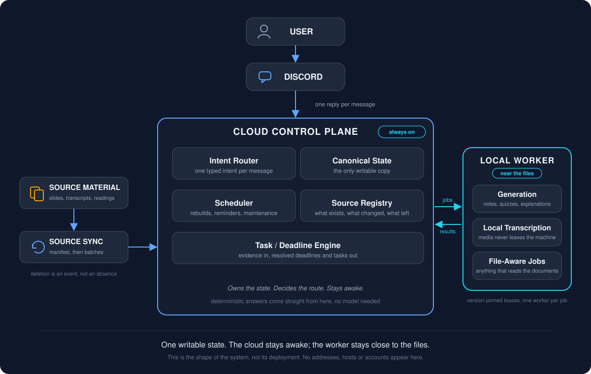

# Architecture

This is the longer version of the 30-second architecture in the README. It describes the shape of the system and the reasons for that shape, not the code.



## The pieces

**Discord adapter.** The only user-facing surface. It receives messages, hands each one to the assistant, sends back exactly one reply per message, and offers a Confirm button when a reply is a preview of a change. It also records a delivery key for every inbound message so a redelivered message is recognised instead of being answered twice.

**Control plane (cloud VM).** A small always-on service. It owns:

- the *intent router*, which turns a message into one typed intent;
- the *canonical state*: tasks, deadlines, source records, weekly build state, notification outbox;
- the *scheduler*, which runs maintenance, rebuilds and reminders on a cadence;
- the *source registry*, which knows every source file, its hash, its week, its category and whether it is currently present;
- the *task and deadline engine*, which turns extracted evidence into deadlines and deadlines into tasks.

**Local worker (my computer).** A loop that claims jobs from the control plane, does them, and reports results. It exists because some work belongs near the files: model-assisted generation of notes and quizzes, local transcription of recordings, and anything that reads the original documents. It never writes to a second copy of the state; it reads jobs and writes results through the control plane.

**Source sync.** A watcher on my computer that builds a manifest of the eligible source folders, notices additions, changes, renames and removals, stages a batch, and ships it to the control plane. The registry on the cloud side decides what each change means.

## The terms, as they apply here

I picked these words up from reading about cloud systems before I understood them. Here is what each one turned out to mean in this project, with the one-line version first.

### Control plane

Basically: the part that knows what the work is and who is doing it.

Properly: the always-on service on the cloud VM. It holds the state, runs the scheduler, routes every message, keeps the source registry, and offers jobs to the worker. It does not transcribe anything or generate notes itself. I originally thought the server was where the heavy work happened. Here the server is mostly coordination, and that is what made the term click.

### Worker

Basically: the part that does the heavy or file-bound jobs, near the files.

Properly: a loop on my computer that claims one job at a time from the control plane, does it, and reports the result back. It advertises the code version it loaded, and it is only offered jobs pinned to that version. If it is offline, generation pauses and everything deterministic keeps working. It never writes to a second copy of the state.

### Canonical state

Basically: which copy gets to be right?

Properly: there is one writable database and it lives on the cloud side. Every other component reads from it or submits changes to it through the control plane. I learned this after briefly having two databases that were "the same" and were not, and then being the reconciliation process myself. Deciding which copy is canonical is a small decision that removes a whole category of problems.

### Source registry

Basically: the list of every file the assistant knows about, and what it knows about each one.

Properly: a record per source file with its content hash, category, week where one can be determined, and whether it is currently present. Adding, changing, renaming and removing a file are all events the registry records. Deletion is a soft delete with history, so a file that comes back is recognised as the same file. Generated study material is never registered here, because output is not evidence.

### Deterministic routing

Basically: answer from data when the data already knows.

Properly: every message becomes one typed intent before any route runs. Intents with a known structured answer (deadline reads, task completions, profile questions, a bare "yes" with something pending) are answered by code and never reach a model. Only synthesis and explanation go to the generative route, and even then the evidence is retrieved first. This is what makes the assistant testable: a deterministic path can be asserted to make zero model calls.

### Failure boundaries

Basically: when one part breaks, what still works, and what stops on purpose.

Properly: worker offline means generation and transcription pause while reads, task updates, reminders and conversational replies continue. Cloud offline means nothing answers, by design, because one honest outage beats two half-working assistants. A sync batch computed against an old manifest is rejected rather than applied. A version mismatch between cloud and worker pauses generation until they agree. I did not plan these boundaries up front. Each one was drawn after something crossed it.

## The main flows

### A question

```text
Discord message
  -> interpret intent (typed: action, domain, object, time window, status scope)
  -> deterministic route if one exists
       deadline read   -> query canonical state -> format -> reply
       task update     -> resolve set -> preview -> wait for Confirm
       conversational  -> short deterministic reply
  -> otherwise retrieve evidence, then one model call to synthesise
  -> log the turn: route taken, model calls made, time spent
```

The point of the typed intent is that the same sentence produces the same structured reading every time, and that every downstream route reads that structure instead of re-reading the English. When two routes used to re-read the sentence independently they occasionally disagreed with each other, which is a confusing thing for an assistant to do.

### A new source file

```text
file lands in a watched folder
  -> sync builds a manifest, notices the difference
  -> batch is staged and shipped to the control plane
  -> registry records the file (or reactivates, renames, or soft-deletes it)
  -> extraction runs: text, structure, deadline evidence
  -> affected week is marked stale
  -> scheduler rebuilds that week's study material
```

Deletion is treated as an event with consequences, not as an absence. A file that disappears is soft-deleted in the registry: its history is kept, anything that depended on it is marked for review, and if the same file comes back it is reactivated under the same identity rather than registered as a stranger.

### A change

```text
"mark my overdue tasks complete"
  -> resolve the exact set from canonical state
  -> pin the ids and show a preview
  -> user confirms
  -> claim a one-time token
  -> apply, once, and record what was applied
```

Reading and writing go through different paths on purpose. The read paths are cheap and free to run. The write path is narrow, previewed and idempotent.

## Where "exactly once" lives

Four places, because I found four ways to do something twice:

1. **Inbound messages.** Each Discord message has a delivery key. A redelivery of the same message is answered from the record, not re-handled.
2. **Worker jobs.** A job is leased to one worker at a time; the lease has a token and a deadline. A worker that dies mid-job loses the lease and the job is offered again.
3. **Confirmations.** A staged change carries a token. The first confirmation claims it; a second (button plus typed "confirm", overlapping turns, a nervous double-click) is recognised as a duplicate and told the truth about what already happened.
4. **Sync batches.** A batch names the manifest it was built from. If the cloud's manifest has moved on, the batch is rejected rather than applied to a state it was not computed against.

## Version consistency

The worker advertises the code version it loaded at startup, and the control plane only offers it jobs pinned to that version. When I deploy, the cloud services are restarted so they load the new code, and the worker is restarted so it advertises the new version. Until both agree, generation pauses and the deterministic paths keep working. This was one of those things that seemed like paranoia until the first time an old worker quietly answered as if it were new.

## What is deliberately simple

There is one database, one router, one worker, one sync process. No queues beyond a table, no service mesh, no container orchestration. The system is small enough that I can hold all of it in my head, which for a learning project is the feature I value most.
