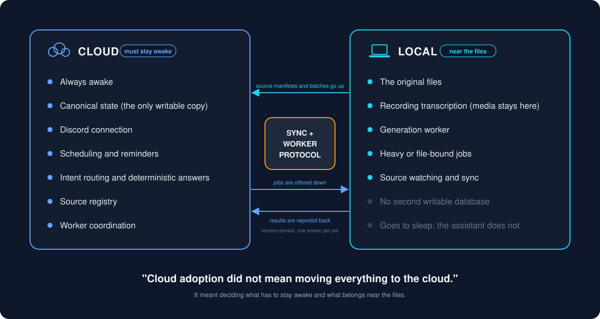

# What cloud adoption meant in this project

I am learning cloud architecture, and this project is where the ideas stopped being slides and started being decisions I had to make. This document is about those decisions. It is a personal learning project and a working prototype, not a platform, and I have tried to write it that way.

## Where it started

Version one ran entirely on my laptop. The Discord bot, the database, the file watcher, the scheduler, everything. It worked well right up until I closed the lid. Then the assistant was asleep, reminders did not fire, and messages sat unanswered until morning.

The obvious fix was "put it in the cloud." The less obvious part was working out what "it" meant.

## Deciding what needs to stay awake

I ended up sorting responsibilities by one question: does this need to be available all the time, or does it need to be near my files?

**Always available, so it lives on the cloud VM:**

- the Discord connection (the front door cannot be closed);
- the canonical state: tasks, deadlines, the source registry;
- the scheduler that runs maintenance, rebuilds and reminders;
- intent routing and every deterministic answer;
- the source registry, including the record of what exists and what disappeared;
- worker coordination: offering jobs, leasing them, recording results.

**Near the files, so it stays local:**

- model-assisted generation of notes and quizzes;
- transcription of recordings (the media never leaves the machine);
- any job that reads the original documents;
- the watcher that notices source changes and ships them up.

This is the lesson I would put in bold if I were the bold-text type: cloud adoption did not mean moving everything to the cloud. It meant deciding which responsibilities need to stay awake and which ones make more sense where the files are.

## Synchronization

Once the registry lived in the cloud, the cloud needed to know what was on my computer. The sync process builds a manifest of the eligible folders, compares it to the last one the cloud confirmed, stages the difference as a batch, and ships it. The cloud applies the batch only if it was computed against the manifest the cloud currently holds; otherwise it is rejected and the watcher tries again with a fresh comparison.

The part that taught me the most was deletion. Early on, a file disappearing from my machine was just an absence in the next manifest, and an absence is easy to apply without thinking. Now a disappearance is an event: the registry soft-deletes the record, keeps its history, flags what depended on it, and reactivates the same identity if the file comes back. Treating deletion as data instead of as silence is the single design change I am most glad I made.

## Service health

Three things run on the VM as services: the Discord bot, the automation scheduler, and a dormant second chat adapter I keep switched off. A health check reports whether each one is active, which code version it loaded, and whether the local worker has been seen recently. When something is wrong the assistant says so in plain terms rather than pretending.

## Version consistency

This one surprised me. Deploying new code to the VM does not change what a running process is executing; it changes what is on disk. A service started before the deploy keeps serving the old code, and every file on disk says the new version is present. The same is true of the local worker.

So a deploy is not "copy the files." It is: refuse to run from a dirty working tree, copy the files, write a version stamp, restart every active service that could have imported the changed code, then restart the worker so it advertises the new version, and finally check that the cloud and the worker agree. Until they agree, generation pauses and the deterministic paths keep working. That is the intended failure mode: a short pause is better than an old worker answering as if it were new.

## Deployment

One script, run from my computer, over a private network connection. It syncs only the code directories, never state, never secrets, never the source material. It writes the version stamp on the cloud side where the running service cannot rewrite it, because provenance a process can edit is not provenance. Then it reconciles the services and the worker as above.

I did not build blue-green deploys or a pipeline. The system is small and I am one person; a script with a clear refusal at the top has been enough.

## State ownership

There is one writable database and it lives on the VM. My computer does not keep a second writable copy that gets merged later. The worker reads jobs and writes results through the control plane. The watcher reads files and ships manifests. Neither of them owns the truth.

I made this rule after briefly having two databases that were "the same" and were not. Reconciling two versions of reality is a job I would rather not have, and the way to not have it is to never create the second version.

## Failure boundaries

- **Local worker offline:** generation and transcription pause; deadline reads, task updates, reminders and conversational replies keep working from the cloud. The assistant is degraded, not gone.
- **Cloud offline:** nothing answers. There is one front door on purpose, and I would rather have an honest outage than two half-working assistants disagreeing with each other.
- **Sync interrupted:** the last confirmed manifest stands; a partial batch is never applied.
- **Deploy mismatch:** generation pauses until versions agree; nothing runs on stale code by accident.

## What I would tell past me

- Decide what must stay awake before you decide what to move.
- Deletion is an event. Design for it on day one.
- One writable state. Everyone else reads.
- A deploy is not done until the running processes say so.
- Keep it small enough to understand. I can still draw the whole system on one page, and that has saved me more times than any tool has.
