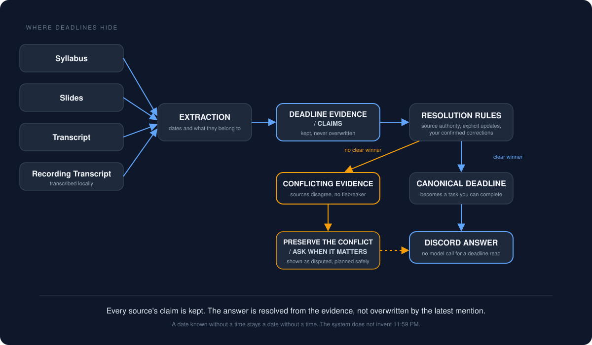

# Deadline pipeline

Deadlines were the first thing I wanted the assistant to track and the last thing I got right.

## The problem

A deadline does not arrive as a row in a table. It arrives as:

- a line in a syllabus,
- a date in the corner of a slide,
- a sentence in a transcript ("that's due next Thursday"),
- a correction in the transcript of a recording ("actually, let's make that Friday"),
- a note I typed to the assistant myself.

Several of those can refer to the same deliverable and disagree with each other. My first version stored one date per deliverable and let the newest mention overwrite it. It took about a week of real use to see the problem: the newest mention is not the most reliable one, and once it overwrote the previous value there was no way to see that anything had ever disagreed.

## Evidence, not values

The current design keeps evidence. Each source that mentions a deadline produces a *claim*: this source, at this location, says this deliverable is due at this time. Claims are stored with the source they came from, an authority level, a strength (explicit statement vs inferred), and whether they were marked as an explicit update to something earlier.

Claims are never overwritten. They are superseded, disputed, or left standing, and the record of that is kept.

## Resolution

A deliverable's canonical deadline is *resolved* from its claims by rules, roughly in this order:

1. A correction I have confirmed myself wins. If I tell the assistant a date is wrong and give the right one, that is the highest authority there is.
2. An official course document outranks a slide, which outranks an offhand mention in a transcript.
3. An explicit update ("this moved to Friday") outranks an earlier statement from the same kind of source.
4. Within the same authority, a specific time outranks a date with no time, and a date with no time is stored as date-only rather than as an invented 11:59 PM.

If the surviving claims still disagree and nothing breaks the tie, the deliverable is marked *disputed*. It stays in the deadline list with a note that the sources disagree, the assistant plans conservatively around the earliest plausible date, and it asks me when it matters. Preserving a disagreement is better than resolving it by coin flip and sounding confident.

## Identity is a separate problem

Before two claims can disagree, the system has to decide they are about the same thing. "Assignment 2", "the second assignment" and "A2 (final)" might be one deliverable or three. Identity resolution is deterministic, uses evidence (aliases seen in sources, parent/child relationships between a project and its stages), and refuses to merge two things on a hunch. When it cannot tell, it asks which one I meant instead of guessing. A wrong merge is worse than a clarifying question.

## From deadline to task

A resolved deadline is projected into a task: something with a status I can mark complete. Projection is idempotent, so re-running it after a change updates the existing task rather than creating a twin. Task *completion* is personal to a user; the deadline definition is shared. Two people using the same assistant see the same deadlines and their own progress.

## Reading it back

"What is due this week?" queries resolved deadlines for a window and formats them by day, in local time, with the source of each date noted when it matters ("corrected by you", "time from the course policy", "date only, time not specified"). No model call. The same formatter is used everywhere a deadline is shown, so a date never looks different depending on which route produced it.

## Corrections

I can correct a deadline in plain language. The assistant reads the correction as an instruction to change state, resolves which deliverable I mean, shows a before-and-after preview, and applies it once I confirm. The correction becomes a new highest-authority claim; the older claims stay in the record as history. Nothing is deleted.

## What I learned

- Store what each source said, not just the current answer.
- Authority is a property of the source, not of recency.
- A disagreement you cannot resolve is information. Keep it visible.
- Identity and value are two different questions. Answer identity first.
- A date with no time is a date with no time. Do not invent one.
